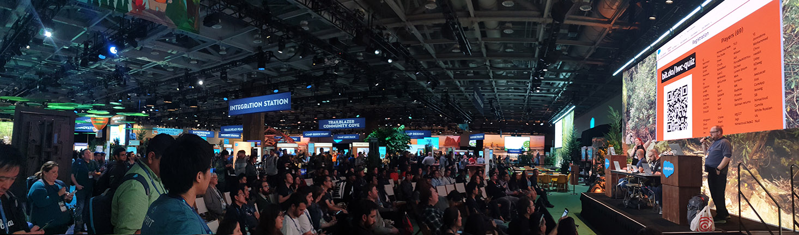
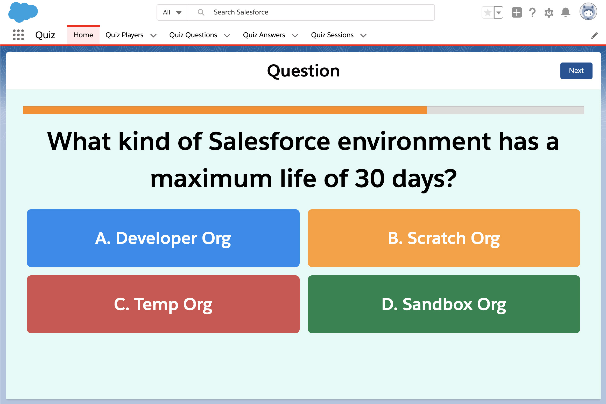
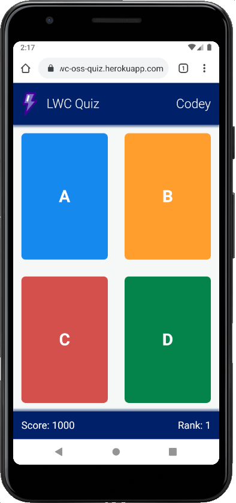
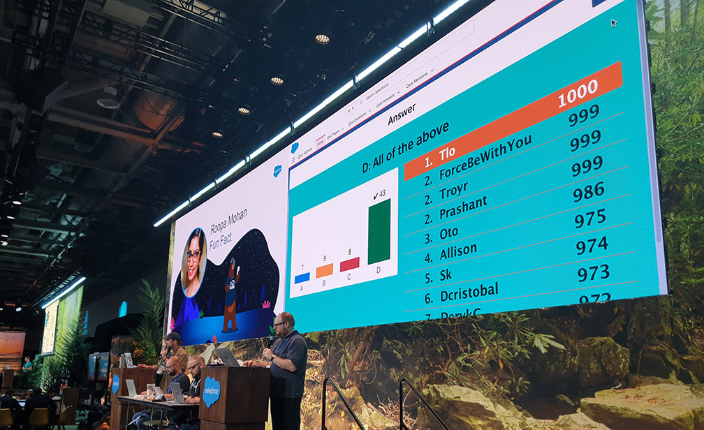

<div align="center">
  
</div>

# Multiplayer quiz app built on Salesforce technology (host app)

[/badge.svg?branch=master>)](https://github.com/pozil/quiz-host-app/actions)

1. [About](#about)
1. [Installation](#installation)
    - [Requirements](#requirements)
    - [Steps](#steps)
1. [Usage](#usage)
1. [Troubleshooting](#troubleshooting)
1. [Building and contributing](#building-and-contributing)

## About

This application is a multiplayer game entirely built on Salesforce technology. A game host presents questions from a Salesforce Org on a shared screen or a video projector. Players compete by answering those questions in real-time using a Lightning Web Component Open Source mobile application hosted on Heroku. The fastest player to give the correct answer scores the most points. As the game progresses, leaderboards are displayed so that players can keep track of scores and ranks.

The quiz app was launched during Developer Game Night at Dreamforce 2019.

<br/>




## Installation

### Requirements

The quiz requires two applications: a host app and a player app.

The host app is a Lightning Web Component (LWC) app running on a Salesforce Org.
You'll need a free [Salesforce Developer Edition (DE)](https://developer.salesforce.com/signup) org or a [scratch org]().

The player app is a mobile app built with Lightning Web Component Open Source (LWC OSS). It runs on Node.js deployed on Heroku.
You'll need a free [Heroku account](https://signup.heroku.com) to set it up.

### Steps

<ol>
    <li>Set up your environment. Follow the steps in the <a href="https://trailhead.salesforce.com/content/learn/projects/quick-start-lightning-web-components/">Quick Start: Lightning Web Components</a> Trailhead project. The steps include:
      <ul>
        <li>Enable Dev Hub in your Trailhead Playground</li>
        <li>Install Salesforce CLI</li>
        <li>Install Visual Studio Code</li>
        <li>Install the Visual Studio Code Salesforce extensions, including the Lightning Web Components extension</li>
      </ul>
    </li>
    <li>If you haven't already done so, authenticate with your hub org and provide it with an alias (<b>myhuborg</b> in the command below):
<pre>sfdx force:auth:web:login -d -a myhuborg</pre>
    </li>
    <li>Clone the repository:
<pre>git clone https://github.com/pozil/quiz-host-app.git
cd quiz-host-app</pre>
    </li>
    <li>Deploy the host app on a scratch org. If your OS is Linux or MacOS, run <code>install-dev.sh quiz developer</code>. If running on Windows, follow these steps for <a href="#manual-scratch-org-deployment">manual scratch org deployment</a>.</li>
    <li>Generate a <a target="_blank" href="https://help.salesforce.com/articleView?id=user_security_token.htm">security token</a> for your user</li>
    <li>Generate a password using <a target="_blank" href="https://passwordsgenerator.net/">this service</a>. This will be the <b>Quiz API Key</b> that you'll set later in both applications.
    <li>Deploy the <b>Quiz Player App</b> to Heroku by clicking this button:<br/>
      <p align="center">
        <a target="_blank" href="https://heroku.com/deploy?template=https://github.com/pozil/quiz-player-app/edit/master" title="Deploy to Heroku">
          
        </a>
      <p>
    </li>
    <li>Set the <b>Config Vars</b> for he Heroku Player app as following:
      <table>
        <tr>
          <th>Variable</th>
          <th>Description</th>
        </tr>
        <tr>
          <td>QUIZ_API_KEY</td>
          <td>The Quiz API key that was generated in step 6.</td>
        </tr>
        <tr>
          <td>SF_LOGIN_URL</td>
          <td>The login URL of your Salesforce org: `https://test.salesforce.com/` for sandboxes or scratch orgs, `https://login.salesforce.com/` for Developer Edition and production.</td>
        </tr>
        <tr>
          <td>SF_PASSWORD</td>
          <td>Your Salesforce password.</td>
        </tr>
        <tr>
          <td>SF_TOKEN</td>
          <td>Your Salesforce user's security token that was generated in step 5.</td>
        </tr>
        <tr>
          <td>SF_USERNAME</td>
          <td>Your Salesforce username.</td>
        </tr>
      </table>
    </li>
    <li>Generate a minified URL for the Heroku player app using <a target="_blank" href="https://bit.do/">this service</a> (I suggest a custom link for greater readability).</li>
    <li>In your Salesforce org, go to <b>Setup &gt; Remote Site Settings</b> and add the complete player app URL (not the minified URL).</li>
    <li>Go to <b>Setup &gt; Custom Metadata Types</b> and add a <b>Quiz Settings</b> record. Set it up with these values:
      <table>
      <tr>
        <th>Field</th>
        <th>Description</th>
      </tr>
      <tr>
        <td>Player App URL</td>
        <td>The Heroku player app URL that was generated in step 7.</td>
      </tr>
      <tr>
        <td>Player App URL Minified</td>
        <td>The minified URL for the player app that was generated in step 6.</td>
      </tr>
      <tr>
        <td>Quiz API Key</td>
        <td>The password that was generated in step 9.</td>
      </tr>
      </table>
    </li>
</ol>

### Manual scratch org deployment

1. Create a scratch org and provide it with an alias (**quiz** in the command below):

```
sfdx force:org:create -s -f config/project-scratch-def.json -a quiz -d 30
```

2. Push the app to your scratch org:

```
sfdx force:source:push
```

3. Assign the **Quiz_Host** permission set to the default user:

```
sfdx force:user:permset:assign -n Quiz_Host
```

4. Load developer questions records:

```
sfdx force:data:tree:import --plan ./data/developer/plan.json
```

5. Generate a password for your user:

```
sfdx force:user:password:generate
```

6. Open the scratch org:

```
sfdx force:org:open
```

## Usage

Once you have installed the app, test it in private to confirm that it works.

Here is how the game works:

1. Open the Salesforce org.
1. Open the **Quiz app** from App Launcher.
1. Make sure that the screen is showing the **Registration** screen. If not, click the **Reset** button.
1. Open the mini URL or scan the QR code with your phone. That should open the player app.
1. Register on the player app. Your player name should automatically appear on the host app.
1. Click on the top right **Start** button on the host app.
1. Your player app should show a "Waiting for question" message for a few seconds then show the 4 answer buttons. If the player app does not refresh, you likely have a setup issue. See troubleshooting.

Shortly before running the official game, make sure to access the player app a first time to load it. This is needed when running on a free Heroku dyno (default install) because there is a wake-up time for the app.

You can reset the game at any time by clicking on the Reset button on top right of the Quiz app. This resets the quiz session to the registration phase, clears previous players and answers.

## Troubleshooting

**Problem:** Player app is not updating when switching game phase (from registration to question for example)

**Solution:**

-   Check that you have registered the correct Remote Site in your org.
-   Check that your Quiz API Key is correctly set up in both the Custom Metadata Types and in the Heroku environment variable.

**Problem:** Something is wrong with the quiz data or you'd like to reset it

**Solution:**

Run the content of the `bin/wipe-data.apxs` file as anonymous apex. This will wipe all quiz data. You'll have to reimport questions.

## Building and contributing

If you want to build the project from sources and contribute, run `npm install` to install the project build tools.

Here is the [Quiz Player App repository](https://github.com/pozil/quiz-player-app).
