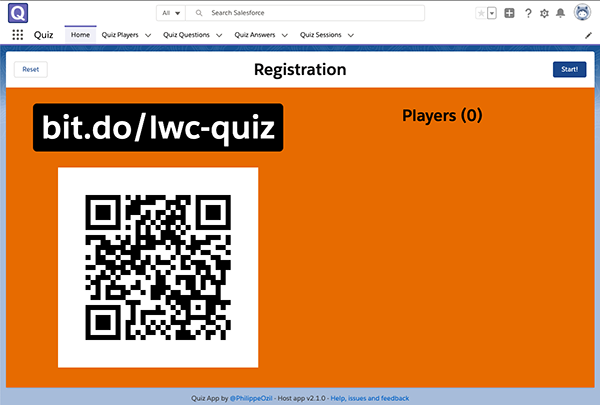

<!-- prettier-ignore-start -->

<!-- ALL-CONTRIBUTORS-BADGE:START - Do not remove or modify this section -->
[](#contributors-)
<!-- ALL-CONTRIBUTORS-BADGE:END -->

<!-- prettier-ignore-end -->

<div align="center">
  
</div>

# Multiplayer quiz app built on Salesforce technology (host app)

[](https://github.com/fostive/quiz-host-app/actions) [](https://github.com/fostive/quiz-host-app/actions) [](https://codecov.io/gh/fostive/quiz-host-app)

1. [About](#about)
1. [Installation](#installation)
    1. [Requirements](#requirements)
    1. [Host App Installation](#step-1-host-app-installation)
    1. [Player App Installation](#step-2-player-app-installation)
    1. [Host App Configuration](#step-3-host-app-configuration)
    1. [Questions Setup](#step-4-questions-setup)
1. [Performance and Scalability](#performance-and-scalability)
1. [Playing](#playing)
1. [Troubleshooting](#troubleshooting)
1. [Building / Developing](#building--developing)
1. [Contributing](#contributing)
1. [Code of Conduct](#-code-of-conduct)
1. [License](#-license)

## About

This application is a multiplayer game entirely built on Salesforce technology. A game host presents questions from a Salesforce Org on a shared screen or a video projector. Players compete by answering those questions in real-time using a Lightning Web Component Open Source mobile application hosted on Heroku. The fastest player to give the correct answer scores the most points. As the game progresses, leaderboards are displayed so that players can keep track of scores and ranks.

The quiz app was launched during Developer Game Night at Dreamforce 2019.

<br/>


## Installation

### Requirements

The quiz requires two applications: a host app and a player app.

The host app is a Lightning Web Component (LWC) app running on a Salesforce org.

The player app is a mobile app built with Lightning Web Component Open Source (LWC OSS). It runs on Node.js deployed on Heroku.
You'll need a free [Heroku account](https://signup.heroku.com) to set it up. A free account lets you run the game with a small group of players. If you run the game with a larger group, consider upgrading to a [Hobby Dyno](https://www.heroku.com/dynos).


### Step 1: Host App Installation

There are two installation options for the host app:

#### Option 1: Managed Package (recommended)

If installing on a Developer Edition org, you first need to set up **My Domain** by following [these instructions](https://help.salesforce.com/articleView?id=environment_hub_get_started_my_domain.htm&type=5) and keeping the default login policy.

1. Click [this link](https://login.salesforce.com/packaging/installPackage.apexp?p0=04t0N000001BlHuQAK) to install the host app package and choose **Install for All Users**.

    You'll need to approve access to `https://chart.googleapis.com`. We use this library to draw leaderboards.

1. Set up permissions:
    1. Navigate to **Setup > Users > Permission Sets**, click **Quiz Host**
    1. Click **Manage Assignments**
    1. Click **Add Assignment**
    1. Check your user and click **Assign**.
1. Navigate to **Setup > Integrations > Change Data Capture**, enable Change Data Capture for the **Quiz Player** object and **Save**.

#### Option 2: Scratch Org (for development purposes)

We assume that you have a working Salesforce DX environment (Salesforce CLI installed, Dev Hub configured and authorized). See this [Trailhead project](https://trailhead.salesforce.com/en/content/learn/modules/sfdx_app_dev/sfdx_app_dev_setup_dx) for guided steps.

1. Open a Terminal and clone the git repository:

    ```
    git clone https://github.com/fostive/quiz-host-app.git
    cd quiz-host-app
    ```

1. Run the installation script. The script deploys the quiz host app on a scratch org with a `quiz` alias and pre-loads `sample` questions.

    MacOS or Linux

    ```
    ./install-dev.sh quiz sample
    ```

    Windows

    ```
    install-dev.bat quiz sample
    ```

    Once the script completes, it will open your new scratch org in a browser tab. If you close the tab or get disconnected, run this command to reopen the org `sfdx force:org:open -u quiz`

### Step 2: Player App Installation

1. Generate a [security token](https://help.salesforce.com/articleView?id=user_security_token.htm) for your Salesforce user.
1. Generate a secure password using [this service](https://passwordsgenerator.net/) or any other. This will be the secret **Quiz API Key** that you'll set later in both applications.
1. Deploy the **Quiz Player App** to Heroku by clicking this button:
   <a target="_blank" href="https://heroku.com/deploy?template=https://github.com/fostive/quiz-player-app/edit/master" title="Deploy to Heroku">
   
   </a>

1. Set the <b>Config Vars</b> for the Heroku Player app as following:

    | Variable                | Description                                                                                                                                                                     |
    | ----------------------- | ------------------------------------------------------------------------------------------------------------------------------------------------------------------------------- |
    | `QUIZ_API_KEY`          | The Quiz API key.                                                                                                                                                               |
    | `SF_LOGIN_URL`          | The login URL of your Salesforce org:<br>`https://test.salesforce.com/` for scratch orgs and sandboxes<br/>`https://login.salesforce.com/` for Developer Edition and production |
    | `SF_PASSWORD`           | Your Salesforce user's password.                                                                                                                                                |
    | `SF_TOKEN`              | Your Salesforce user's security token.                                                                                                                                          |
    | `SF_USERNAME`           | Your Salesforce username.                                                                                                                                                       |
    | `SF_NAMESPACE`          | The Salesforce package namespace (leave the `sfqz` default value unless you are developing with a Scratch org).                                                                 |
    | `COLLECT_PLAYER_EMAILS` | Whether the app should collect player emails (true/false).                                                                                                                      |

### Step 3: Host App Configuration

1. In your Salesforce org, go to **Setup > Remote Site Settings** and add a new site named `Quiz_Player_App` with the player app URL.
1. Generate a minified URL for the Heroku player app using [this service](https://bit.do/) or any other URL shortener (opt for a custom link for greater readability).
1. Go to **Setup > Custom Metadata Types** and click **Manage Records** next to **Quiz Settings**.
1. Click **New** and add a record with these values:

    | Field                     | Description                                               |
    | ------------------------- | --------------------------------------------------------- |
    | `Player App URL`          | The Heroku player app URL.                                |
    | `Player App URL Minified` | The minified URL for the player app.                      |
    | `Quiz API Key`            | The password that was generated earlier.                  |
    | `Question Timer`          | The duration of the question timer (default: 12 seconds). |

1. Using the App Switcher, navigate to the **Quiz** Lightning app. If the installation went well, the quiz page should appear with no errors:



At this point you can:

-   [test the game](#playing) with the sample question.
-   [set up extra questions](#step-4-questions-setup)

### Step 4: Questions Setup

Questions are stored as **Quiz Question** records.

The **Quiz Session** record controls the list of selected questions and specifies the questions' order. Use the component on this record page to rearrange questions (don't forget to save your changes).

You org should have one and only one **Quiz Session** record at any time.

Make sure to edit the **Quiz Session** record after adding new questions as they aren't automatically added to the quiz.

#### Option 1: Importing questions using the Data Import Wizard (Recommended)

You can create or import questions by adding records manually or by importing them in a CSV or XLS file with the [Data Import Wizard](https://help.salesforce.com/apex/HTViewHelpDoc?id=data_import_wizard.htm).

Use this table template to save time:

| Label     | Answer A | Answer B | Answer C | Answer D | Correct Answer |
| --------- | -------- | -------- | -------- | -------- | -------------- |
| 1 + 1 = ? | 1        | 2        | 3        | 4        | B              |

#### Option 2: Importing questions using the Salesforce CLI

You can import questions with the Salesforce CLI.

1. Get a zip with custom questions and extract in the `data` folder. Assuming that your custom question folder is named `CUSTOM_QUESTIONS`, you should have the following files and folders:

    ```
    /data
    /CUSTOM_QUESTIONS
        /plan.json
        /sfqz__Quiz_Question__cs.json
        /sfqz__Quiz_Session__cs.json
        /sfqz__Quiz_Session_Question__cs.json
    ```

1. Run this script to remove existing questions:

    ```
    sfdx force:apex:execute -f bin/wipe-data.apex
    ```

1. Run this script from the project root to import your custom questions:

    ```
    sfdx force:data:tree:import -p data/CUSTOM_QUESTIONS/plan.json
    ```

## Performance and Scalability

Performance is critical to the game experience: it must be as close as possible to real-time.

In full transparency, we have no precise benchmark on how well the game scales and which kind of Dyno to use but here are some pointers:

-   A free Heroku Dyno supports a 50 player game just fine.
-   The app has worked flawlessly with 400 players on a Heroku Performance dyno but we never tested with more.

All the pressure lies on the Heroku infrastructure and in particular on the Node.js WebSocket server. We cannot guarantee how the network (sockets and load balancer) behave at large scale.

Note that Heroku datacenters are only available in North America and Europe. If you are running the quiz from another region (i.e.: India, Australia...), there's a chance that players will experience some lag.

## Playing

🎥 [Watch the playthrough video](https://www.youtube.com/watch?v=vLTZ_jdwhRo)

Once you have installed the app, test it in private to confirm that it works.

Here is how the game works:

1. Open the Salesforce org.
1. Open the **Quiz app** from App Launcher.
1. Make sure that the screen is showing the **Registration** screen. If not, click the **Reset** button.
1. Open the mini URL or scan the QR code with your phone. That should open the player app.
1. Register on the player app. Your player name should automatically appear on the host app.
1. Click on the top right **Start** button on the host app. Once the game is started, players are no longer able to register.
1. Your player app should show a "Waiting for question" message for a few seconds then show the 4 answer buttons. If the player app does not refresh, you likely have a setup issue. See troubleshooting.

**Scoring system**

Players start with a zero score. The fastest player to answer a question correctly earns 1000 points.
Players who also answered correctly but slower will earn a decreasing number of points depending on how late they answered. Wrong answers grant no points. The player that scores the most points at the end of the game wins.

**Player app wake-up**

Shortly before running the official game, make sure to access the player app a first time to load it.<br/>
The default Heroku setup uses a free Heroku dyno. This implies that apps that are inactive for more than 30 minutes are put to sleep. Any connection to the app will wake it up but it takes a bit less than a minute. You may experience some "Request time out" errors during that wake-up time.

If you are running the game with 50+ players, consider upgrading to a [Hobby dyno](https://www.heroku.com/dynos).

**Resetting the game**

You can reset the game at any time by clicking on the Reset button on top right of the Quiz app. This resets the quiz session to the registration phase, clears players and previous answers.

## Troubleshooting

Review these common problems. If you can't find a solution to your problem, [open a new issue](https://github.com/fostive/quiz-host-app/issues).

**Player app is not starting (Heroku error page is displayed)**

-   Check the Heroku app logs for the cause of the error. The app will refuse to start if your Salesforce credentials are incorrect (most likely error).
-   Verify your Salesforce credentials in the configuration variables of your Heroku app.

**Player app is not updating when switching game phase (from registration to question for example)**

-   Check that you have registered the correct Remote Site in your org.
-   Check that your Quiz API Key is correctly set up in both the Custom Metadata Types and in the configuration variables of your Heroku app.

**Player app is slow/lags, questions do not show up on time**

See the [Performance and Scalability](#performance-and-scalability) section.

**Something is wrong with the quiz data or you'd like to reset it**

-   Reset the game using the Reset button on the quiz app. This resets the quiz session to the registration phase, clears players and previous answers.
-   Run the following script wipe ALL quiz data. You'll have to reimport questions.
    ```
    sfdx force:apex:execute -f bin/wipe-data.apex
    ```

**You're seeing a "Failed to validate Quiz app settings: Read timed out" error on the host app**

Refresh the page to fix the problem. Refer to the **Player app wake-up** section of this document for more information.

## Building / Developing

If you want to build the project from sources and contribute, run `npm install` to install the project build tools.

Here is the [Quiz Player App repository](https://github.com/fostive/quiz-player-app).

## Contributing

We love contributions, small or big, from others!

Please see our [CONTRIBUTING](https://github.com/fostive/.github/blob/main/CONTRIBUTING.md) guidelines. The first thing to do is to discuss the change you wish to make via issue, email, or any other method with the owners of this repository.

Also, review our [code of conduct](https://github.com/fostive/.github/blob/main/CODE_OF_CONDUCT.md). Please adhere to it in all your interactions with this project.

Thanks goes to these wonderful ✨ people ([emoji key](https://allcontributors.org/docs/en/emoji-key)) for contributing to the project:

<!-- ALL-CONTRIBUTORS-LIST:START - Do not remove or modify this section -->
<!-- prettier-ignore-start -->
<!-- markdownlint-disable -->
<table>
  <tr>
    <td align="center"><a href="https://pozil.github.io"><br /><sub><b>Philippe Ozil</b></sub></a><br /><a href="https://github.com/fostive/quiz-host-app/commits?author=pozil" title="Code">💻</a> <a href="#design-pozil" title="Design">🎨</a> <a href="#ideas-pozil" title="Ideas, Planning, & Feedback">🤔</a> <a href="https://github.com/fostive/quiz-host-app/commits?author=pozil" title="Documentation">📖</a> <a href="https://github.com/fostive/quiz-host-app/pulls?q=is%3Apr+reviewed-by%3Apozil" title="Reviewed Pull Requests">👀</a></td>
    <td align="center"><a href="https://github.com/mlezer-bd"><br /><sub><b>mlezer-bd</b></sub></a><br /><a href="https://github.com/fostive/quiz-host-app/commits?author=mlezer-bd" title="Documentation">📖</a></td>
  </tr>
</table>

<!-- markdownlint-enable -->
<!-- prettier-ignore-end -->
<!-- ALL-CONTRIBUTORS-LIST:END -->

This project follows the [all-contributors](https://github.com/all-contributors/all-contributors) specification. Contributions of any kind welcome!

## 📄 Code of Conduct

Please review and adhere to our [CODE_OF_CONDUCT.md](https://github.com/fostive/.github/blob/main/CODE_OF_CONDUCT.md) before contributing to this project in any way (e.g. creating an issue, writing code, etc).

## 📝 License

This project is licensed under the Creative Commons Zero v1.0 License. See the [LICENSE](LICENSE) file for details.
